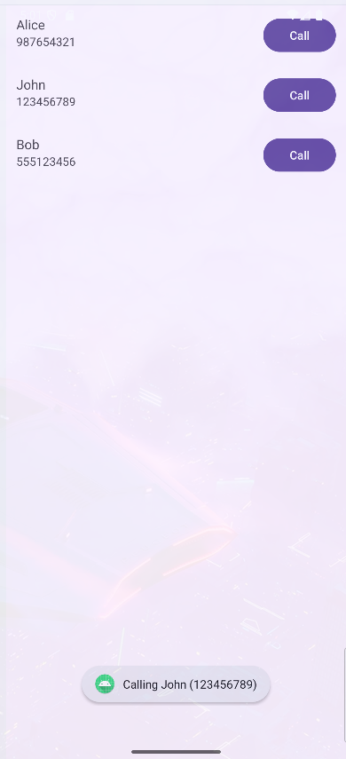

# RecycleView Simple Example

This is a simple Android application demonstrating the use of `RecyclerView` to display a list of people with their names and phone numbers. Each item in the list includes a button to simulate calling the person.

## Features
- Uses `RecyclerView` for efficient list rendering.
- Custom adapter (`PersonAdapter`) to bind data.
- Each list item displays a name, phone number, and a "Call" button.
- Clicking the "Call" button shows a Toast message with the person's name and phone number.

## Project Structure
- `MainActivity.kt`: Sets up the RecyclerView and provides sample data.
- `Person.kt`: Data class representing a person.
- `PersonAdapter.kt`: RecyclerView adapter and ViewHolder implementation.
- `activity_main.xml`: Layout for the main activity containing the RecyclerView.
- `item_person.xml`: Layout for each item in the RecyclerView.

## How to Run
1. Open the project in Android Studio.
2. Build and run the app on an emulator or physical device.
3. The main screen will display a list of people. Tap the "Call" button to see a Toast message.

## Screenshots

## Requirements
- Android Studio (Arctic Fox or newer recommended)
- Minimum SDK: 21 (Android 5.0 Lollipop)

## License
This project is for educational purposes.

