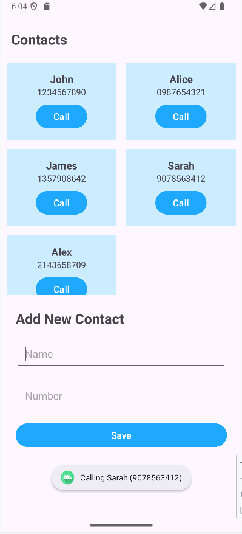
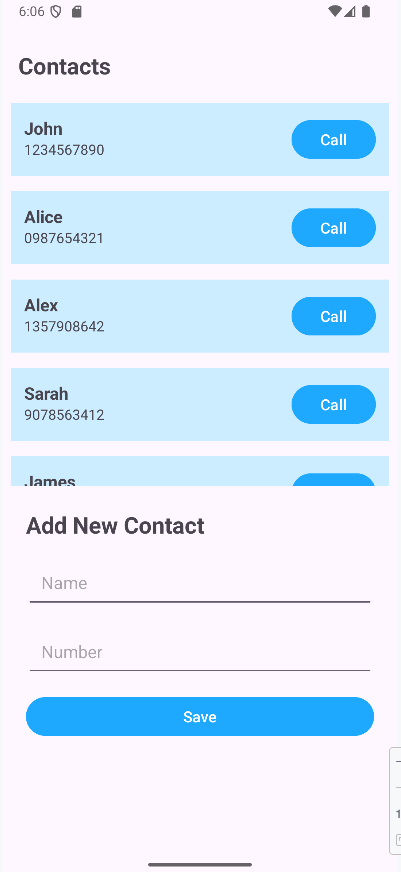

# Contacts RecyclerView App

This Android application demonstrates the use of `RecyclerView` to display and manage a list of contacts. Users can add new contacts and simulate calling them via a button. The app supports both linear and grid layouts for displaying contacts.

## Features
- Add new contacts with name and phone number
- Display contacts in a list or grid using RecyclerView
- "Call" button for each contact shows a Toast message
- Uses ViewModel and LiveData for state management
- Modern UI with Material Design components

## Screenshots

## Dependencies
The following dependencies are used in this project (see `app/build.gradle.kts`):

- androidx.lifecycle:lifecycle-viewmodel-ktx:2.9.2
- androidx.lifecycle:lifecycle-livedata-ktx:2.9.2
- androidx.fragment:fragment-ktx:1.6.2
- androidx.core:core-ktx
- androidx.appcompat:appcompat
- com.google.android.material:material
- androidx.activity:activity
- androidx.constraintlayout:constraintlayout
- junit:junit (test)
- androidx.test.ext:junit (androidTest)
- androidx.test.espresso:espresso-core (androidTest)

## Project Structure
- `MainActivity.kt`: Loads fragments for contact list and add form
- `ListFragment.kt`: Displays contacts using RecyclerView
- `AddFragment.kt`: Form to add new contacts
- `PersonAdapter.kt`: RecyclerView adapter for contacts
- `PeopleViewModel.kt`: ViewModel for managing contact data
- `Person.kt`: Data class for contact info
- Layouts: `activity_main.xml`, `fragment_list.xml`, `fragment_add.xml`, `item_person_list.xml`, `item_person_grid.xml`

## How to Run
1. Open the project in Android Studio.
2. Build and run the app on an emulator or device.
3. Add contacts and view them in list or grid format. Tap "Call" to see a Toast message.

## Requirements
- Android Studio (Arctic Fox or newer recommended)
- Minimum SDK: 21 (Android 5.0 Lollipop)

## Author
- Haikal Putrayudha
- 21604483
